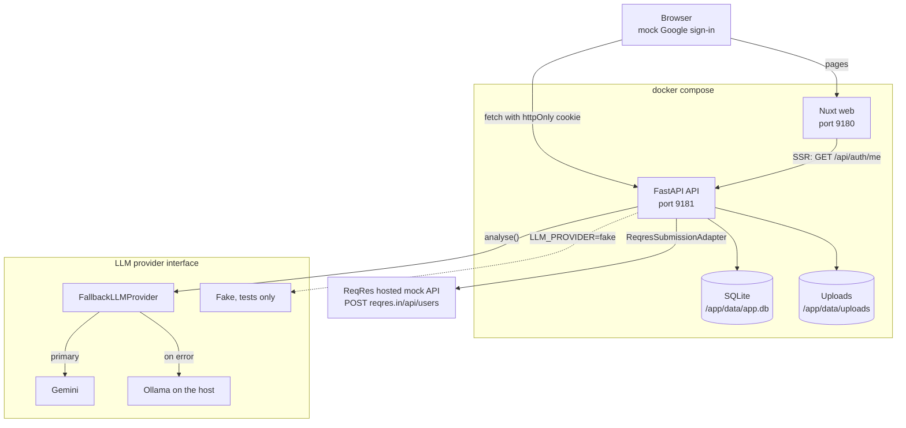
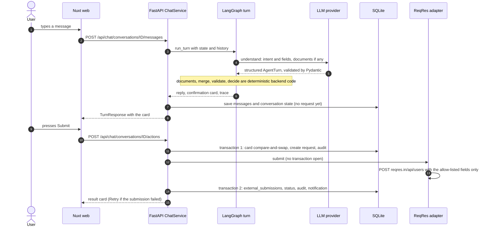
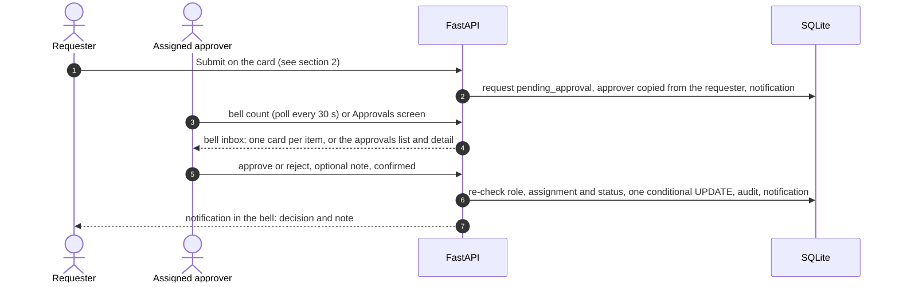
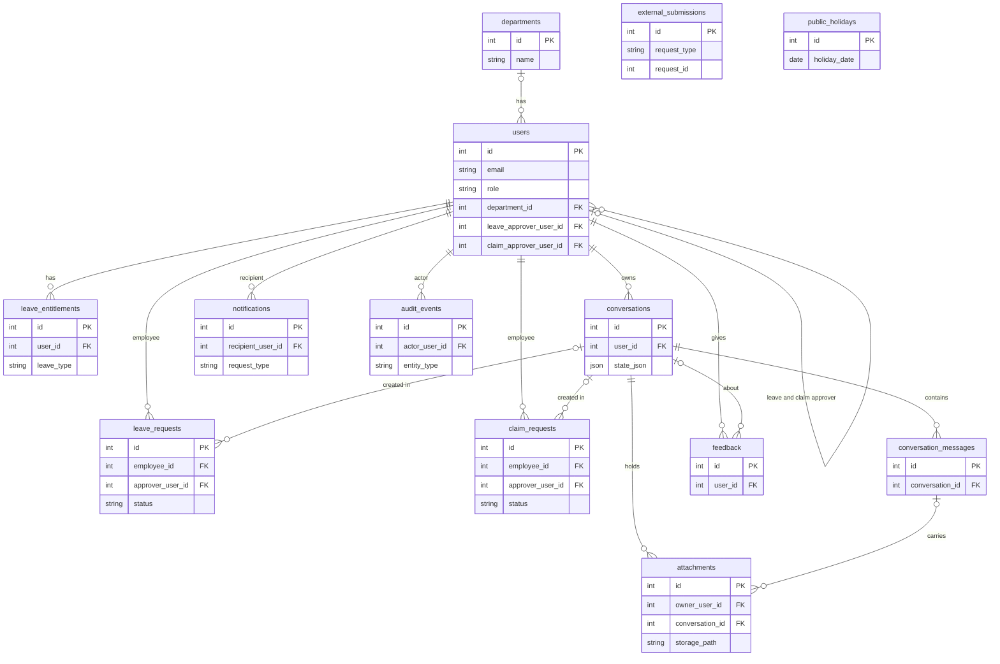

# Architecture

A one-page map of the PoC. All data is fictional. Diagrams are Mermaid (GitHub renders them). The
bell inbox is described only as far as [inbox-design.md](inbox-design.md) says.

## 1. System overview



- `sqlite` and `uploads` live in the same named volume `api-data`, so `docker compose down -v`
  deletes both.
- Sign-in is a mock Google account picker. `POST /api/auth/mock-google/login` sets a real HS256 JWT
  in an `httpOnly`, `SameSite=Lax` cookie (`scmp_session`); page scripts never see it.
- `LLM_PROVIDER` picks the primary provider (`gemini`, `ollama` or `fake`); `LLM_FALLBACK_PROVIDER`
  wraps it in `FallbackLLMProvider`, which switches to the fallback on an error and skips the
  primary for `LLM_FALLBACK_COOLDOWN_SECONDS`. Containers reach Ollama at `host.docker.internal:11434`.
- `SUBMISSION_PROVIDER=reqres` is the assignment integration; `fake` exists for tests only.

## 2. One chat turn



Graph nodes (`backend/app/agent/graph.py`): `load_context`, `understand`, `documents`, `merge`,
`validate`, `decide`, `respond`, plus `prepare_update`, `prepare_cancel`, `status`, `balance`,
`explain`, `clarify`, `refuse`, `error_reply`. Only `understand` calls the LLM.

## 3. Approval flow



Both entry points (the Approvals screen and, per the inbox design, the bell inbox) use the same
rules: the caller must be the assigned approver, the request must still be `pending_approval`, a
second simultaneous decision gets `409`, and limits are shown but never block.

## 4. Data model



`external_submissions`, `notifications` and (once linked) `attachments` point at a request with
`request_type` + `request_id`, not a foreign key, because a request is either a leave or a claim.
`schema_meta` (one row, `schema_version`) is not drawn.

## 5. Trust boundaries

- **The LLM only extracts.** It classifies intent and fills fields (and reads attached documents).
  It cannot approve, write to the database or call an integration; its output is validated by
  Pydantic before it changes any state.
- **FastAPI and Pydantic decide.** Validation, dates and working days, balances, roles, approver
  routing and status changes are backend code. Wording of every number is deterministic.
- **Nothing is saved or sent before Submit.** A request is created only when the user presses
  the card button (typing "yes" does not count); the card action is compare-and-swap guarded, so a
  double click gets `409`.
- **Approver actions are re-checked on the backend** (role, assignment, pending status), and the
  role and active flag are re-read from the database on every request, not trusted from the JWT.
- **Only the specified fields go to ReqRes** (`email`, `leave_type` or `claim_type`, dates or
  `amount`, `receipt_date`), built by `to_wire()`. Notes, attachments and everything else stay local.
- **Text in documents is data**, never an instruction. Uploads are typed by their bytes.

## 6. Where things live

```text
backend/
  app/
    main.py            FastAPI app, CORS and CSRF middleware, startup DB init and seed
    config.py          Settings from environment and the repo-root .env
    cli.py, seed.py    python -m app.cli tools (seed, reset-demo, set-approvers ...), demo data
    agent/graph.py     LangGraph chat turn
    chat/              conversation state, validation, cards, documents, actions, bell inbox
    llm/               provider interface, Gemini, Ollama, fake, fallback wrapper, prompts
    integrations/      submission adapters: ReqRes (assignment) and fake (tests)
    api/               router, dependencies, routes (auth, chat, approvals, notifications, ...)
    auth/              JWT, current user and role guards, CSRF middleware
    services/          audit, approvals, balances, routing, notifications, attachments, holidays
    domain/            pure rules: enums, status transitions, roles, leave day maths
    db/                SQLAlchemy models, engine and SQLite pragmas, additive migrate.py
    schemas/           Pydantic API models
    resources/         bundled 1823 Hong Kong holiday calendar (immutable application asset)
  tests/               pytest, offline (fake LLM, in-memory or temp SQLite)
  samples/, scripts/   fictional sample documents, opt-in live smoke scripts
frontend/
  app/pages/           / (chat), /login, /no-access, /approvals (list and detail)
  app/components/      chat, cards, header, bell, approvals, attachments
  app/composables/     useApi, useChat, useAuth, useInbox, usePolling ...
  app/utils/, types/   pure helpers and contract types
  app/middleware/      auth.global.ts route rules
  tests/, scripts/     Vitest, mock API stub for UI work
docs/                  design notes, business rules, test cases, this file, troubleshooting
scripts/reset-demo.sh  put the demo data back to the start
e2e/                   Playwright end-to-end tests (own servers on 9280/9281) and the screenshot script
docs/screenshots/      five fictional-data screenshots produced by `cd e2e && bun run screenshots`
```

## 7. Key design choices and trade-offs

- **Per-user approvers.** Each user row stores a leave and a claim approver, copied onto the request
  when it is created. Simple to explain and change (`set-approvers`); departments only drive limits.
- **Limits are shown, never blocking.** Balances and department budgets inform the approver, who
  decides. Nothing is rejected automatically.
- **SQLite for the PoC.** One file in a Docker volume, WAL mode, no server to run. Not meant for
  concurrent production use.
- **Additive migrations, otherwise reset.** `sync_schema` only adds nullable columns; a
  change SQLite cannot do in place bumps `SCHEMA_VERSION`, and the operator resets the demo
  (`scripts/reset-demo.sh`). No Alembic.
- **Local Ollama fallback.** Gemini free-tier quota can run out mid-demo, so a local model takes over
  automatically, at the cost of slower and less accurate answers.
- **Cookie session, not a bearer token in JS.** `httpOnly` cookie plus `X-Requested-With` and Origin
  checks; web and API must share a host name (`localhost`).
- **Our own date formatting.** The UI never uses `toLocaleString` or `Intl` for dates: their output
  varies with the runtime's ICU data ("Sep" vs "Sept", "24:05" for midnight) and the machine time
  zone, so the server render and the browser could disagree. `formatDateTime` / `formatClock` in
  `frontend/app/utils/chat.ts` produce a fixed "25 Sep 2026, 11:05" in Hong Kong time (UTC+8).
- **Polling, not websockets.** The bell and the approvals badge refresh every 30 s and on window
  focus. Much simpler; a new notification can take up to 30 s to appear.
- **One deterministic card for every state change.** The model proposes, the backend builds the card,
  the user presses the button; this is what makes the LLM safe to use here.
